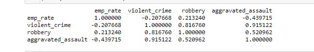

# Crime in the Time of Corona - Exploratory Data Analysis of FBI Crime and Unemployment data 1980 - 2018
Preliminary Data Analysis of FBI national crime data and unemployment data from 1980-2018.

## Data sources description

- Crimes: a csv file containing counts of crime for major crime categories by state and by year for years between 1980 and 2018.
- Unemployment: a csv file containing unemployment rates by state and by year for years between 1980 and 2018.

## Data cleaning and preparation
- Crimes - Imported data. Dataset clean. Nothing dropped. 
- Crimes - Inspected data types. No conversions needed for analysis.
- Summary data frame created of sum of types of crimes grouped by year. 
- Employment - Imported data as data frame. Dataset clean. Nothing dropped.  Data types are fine.
- Merged crime and employment datasets on year.

## Exploratory Analysis

The overall goal of this analysis is to preliminarily identify relationship patterns between crime and unemployment.

*Overall Correlation Matrix of all Crimes*  A correlation matrix of counts of all crime categories and unemployment showed:

- A moderately negative relationship between unemployment rates and  aggravated assault at -0.439. 
- A weak positive relationship between aggravated assault and robbery at 0.21.
- Violent crime paints an overall picture of crime, and correlates strongly with robbery at 0.82 and aggravated assault at 0.92

*? Question matrix review*  Perhaps aggravated assault tends to capture domestic crime while robbery may be better at capturing crime non domestic crime?

*Revised Correlation Matrix*  Given we can do the analysis and tell our story with the three crime measures of violent_crime, robbery, and domestic violence; a revised correlation matrix is presented below

 

*Distribution of data*  Whisker plots and describe() show that all four of our variables are somewhat balanced, with no outliers and skewed slightly upwards, meaning there  greater variability in the upper ranges than the lower ranges. For example the whisker plot for Unemployment, shown below, highlights a moderately skewed distribution with a mean of 5.9, a medium of 5.4, a minimum of 3.8, and a max of  9.21. 

This suggests there are "floors" to the crime and unemployment counts, but counts fluctuate more in the upper ranges, so when it gets bad it can get really bad.

*Plotting Unemployment*  As shown below, the unemployment rate can vary greatly from year to year.  Its not really a linear relationship, so perhaps logs will need to be used in modeling.  

This plot is what we wish to compare with our crime plots!

*Plotting Major Crime Categories.*  As shown below, crime rates for Violent Crime, Robbery and Aggravated Assault do trend in a similar pattern, with greater variance in Violent Crimes in the early 1990s. 

*Summary of Exploratory Analysis*  While there are clear patterns in crimes over the years, they do not visually appear to correlate with Unemployment rates. Further, deeper, analysis will try to identify any relationships that do exist.  

