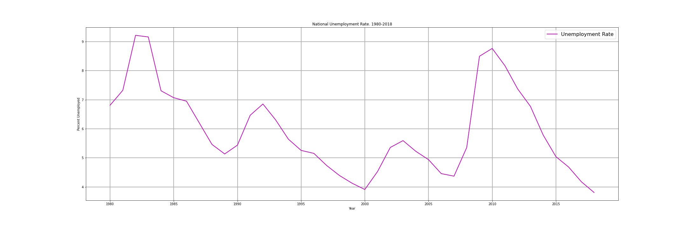
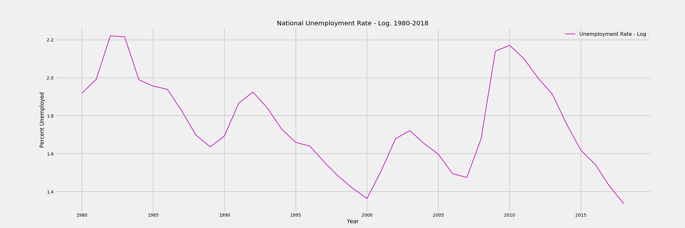
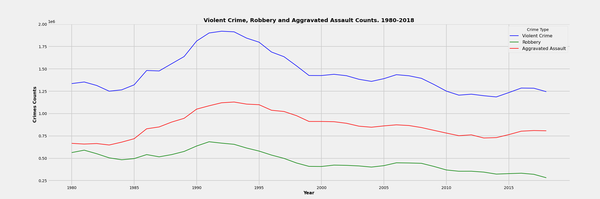
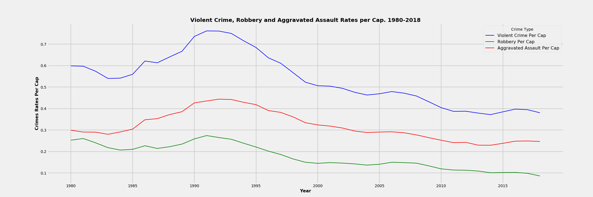
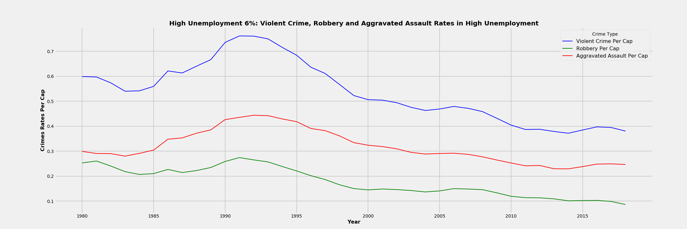
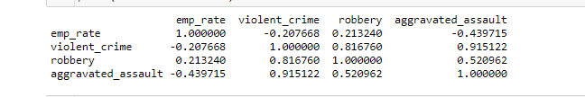
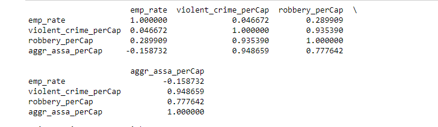

# Crime in the Time of Corona - Secondary Data Analysis of FBI Crime and Unemployment data 1980 - 2018
Secondary Data Analysis of FBI national crime data and unemployment data from 1980-2018.

### Transformation of Employment Rate to a natural log.

 Since the employment rate is bimodal, this makes linear regression more difficult to assess. Applied various logs to the employment rate but this did not help achieve normalization of the field. The first picture shows the distribution of the employment rate, and the second pictures shows a log distribution. 

### Compare crime counts vs  crimes per capita. 

Reshaping the dataset to crimes per capita does not alter the shape and feel of the dataset. The first plot shows the count of crimes while the second shows the crimes per capita.

### Compare crime in times of High Unemployment. 

Defining high unemployment to 6% shows little visual difference in the shape and feel of crime during times of high unemployment. However, this data set is now restricted to less than thirty rows, so this analysis may prove to be more fruitful with raw data set where time is by week or by day.

All the crime distribution graphs show that the second peak in unemployment in our dataset is not matched by a peak in crime.

### Comparative Correlation Matrixes

The first matrix shows the raw data, while the second shows per capita data, and the 3rd shows only high unemployment years per capita.

